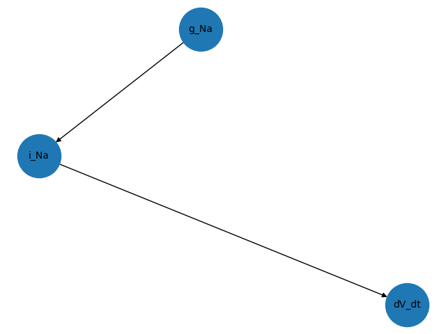

# modelgraph

A tool for visualizing dependencies between different components of your model.

## Motivation
Assume you have some model, represented as a system of ODEs with potentially several intermediation expression. For example in the classical Hodgkin Huxley model of the squid axon from 1952 we have the following expressions

```git@github.com:ComputationalPhysiology/modelgraph.git
dV_dt = -(-i_Stim + i_Na + i_K + i_L)/Cm
i_Na = g_Na*m**3*h*(V - E_Na)
```
From this we can deduce that `i_Na` depends on the parameter `g_Na`, and since `dV_dt` depends on `i_Na` it also depends (indirectly) on the parameter `g_Na`.

In `modelgraph` we can visualize this dependency using the following code snippet
```python
from modelgraph import DependencyGraph
import gotran

# Load ode using gotran
ode = gotran.load_ode("hodgkin_huxley_squid_axon_model_1952_original.ode")
# Build dependency graph
graph = DependencyGraph(ode)
# Get the components that depends on g_Na (we call this inverse dependents)
G = graph.inv_dependency_graph("g_Na")
# Visualize using matplotlib (python -m pip install matplotlib)
import matplotlib.pyplot as plt
nx.draw(G, with_labels=True, font_size=10, node_size=2000)
plt.savefig("g_Na_mpl.png")
```



```python
# Or using pydot (python -m pip install pydot)
P = nx.nx_pydot.to_pydot(G)
P.write_png("g_Na_pydot.png")
```


It is also possible to


## Installation
Install with pip
```
python3 -m pip install modelgraph
```


## Documentation

Documentation is hosted at http://computationalphysiology.github.io/modelgraph.

## Automated test

Tests are provided in the folder [tests](https://github.com/ComputationalPhysiology/modelgraph/tree/main/tests). You can run the tests with pytest

```
python3 -m pytest tests -vv
```

## Contributing
See [the contributing section](https://computationalphysiology.github.io/simcardems/CONTRIBUTING.html)


## Authors
- Henrik Finsberg (henriknf@simula.no)

## License
MIT
